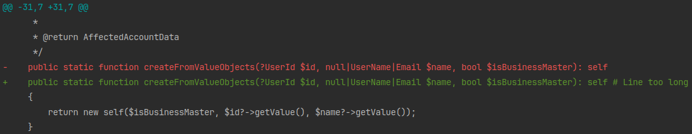

PHP Line Length Checker
=======================

Custom rule for [PHP-CS-Fixer](https://github.com/PHP-CS-Fixer/PHP-CS-Fixer).  
Checks that the length of lines does not exceed 120 characters.  
Doesn't fix anything.  

### How it works
Searches for the line that exceed max length limit and mark it by adding comment:  
``` # Line too long```  

To see which lines violates the rule you should run the command with the`--diff`  flag.  

DIff example:
<p>
    
</p>

Works only for `check` command and `fix` command with `--dry-run` flag. Does nothing in other cases.


### Installation
Install package:
```console
composer require --dev gordinskiy/line-length-checker
```
Register rule in PHP-CS-Fixer config file:
```php
<?php
// ...
return (new PhpCsFixer\Config())
    // ...
    ->registerCustomFixers([
        new Gordinskiy\LineLengthChecker\Rules\LineLengthLimit()
    ])
;
```

Enable rule in PHP-CS-Fixer config file:
```php
<?php
// ...
return (new PhpCsFixer\Config())
    // ...
    ->setRules([
        'Gordinskiy/line_length_limit' => true,
    ])
;
```

### Configuration
Default limitation is 120, but it can be configured by `max_length` option:
```php
<?php
// ...
return (new PhpCsFixer\Config())
    // ...
    ->setRules([
        'Gordinskiy/line_length_limit' => ['max_length' => 115],
    ])
;
```
